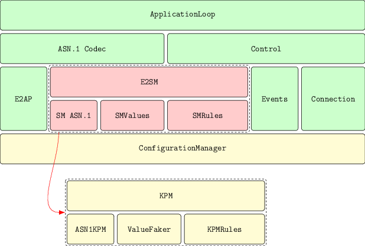

# e2node architecture

The architecture is divided in 3 groups: in green we see framework components, in yellow the simulator components, and in red we see Service Model components. The Service Model components are, from the framework components perspective, abstract interfaces that the system uses to access the Service Model. I also included an example of one Service Model concrete implementation, KPM.

The remainder are concrete implementations.

## Framework
The framework is composed of the ApplicationLoop and multiple supporting elements: the ASN.1 codec, the events infrastructure and the connection manager. This component is initaially inspired in the [reactor](https://en.wikipedia.org/wiki/Reactor_pattern) software pattern.

After the startup, the ApplicationLoop will request the Event manager for events. In case no events are available, the loop will block until events are available. Events in this case are timer events, network data events and events generated by the user plane protocol stack. Once events are available, the ApplicationLoop will send these events to RequestHandlers to be handled.

The Event manager implements events as file descriptor like objects: sockets for events comming from the RIC, [message queues](https://man7.org/linux/man-pages/man7/mq_overview.7.html) (or [eventfd](https://man7.org/linux/man-pages/man2/eventfd.2.html)) for events comming from the protocol stack, and [timerfd](https://man7.org/linux/man-pages/man2/timerfd_create.2.html) for timer events. All these objects can be used with [poll](https://man7.org/linux/man-pages/man2/poll.2.html), so this first architecture relies on the operating system. A future abstraction will be provided.

The Connection manager is responsible for communicating with the RIC thorugh SCTP. Some of the Fault Injection mechanisms we proposed will be implemented in this object.

## Service Model
The Service Model part contains the Service Model implementation, composed of the ASN.1 implmentation, the data gatherer and the rules engine.

The ASN.1 implementation is generated from the specification provided ASN1 model by using [asn1c](https://github.com/nokia/asn1c). Abstractions can be provided to facilitate handling the models. The data gatherer will interact with the system to provide the data for the requests (mostly, REPORT E2 messages). In the simulator, this data will be generated. The rules engine is responsible for implementing changes to the node, when it is required (POLICY and CONTROL E2 messages).

## Simulator
The simulator implements an ConfigurationLoader and provides a Service Model to the framework. The Service Model selected for the initial implementation is the E2 KPM model, with values generated at random, following a given statistical distribution: equivalued, normal or constant. The ConfigurationLoader will load the configuration of values and fault injection mechanisms from a file and build the service model that will be used in the simulation. This allows the use of multiple models in different instances of the simulator.

## Fault injection
The Fault Injection techniques we are interested in are
- Value fault injection: these generate values that are corrupted or fall outside possible values. The intention is to see how the RIC handles these bad values. It is implemented in the Service Model.
- Network fault injection: network partitions and egress packet delays. This fault injection if implemented in the Connection manager
- Malformed packet faults: giberish data, faults in the transmission line and so on. This implementation occurs in several components: E2AP, E2SM and Connection manager.
